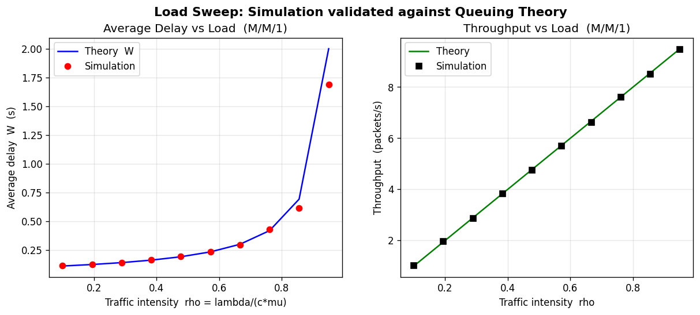
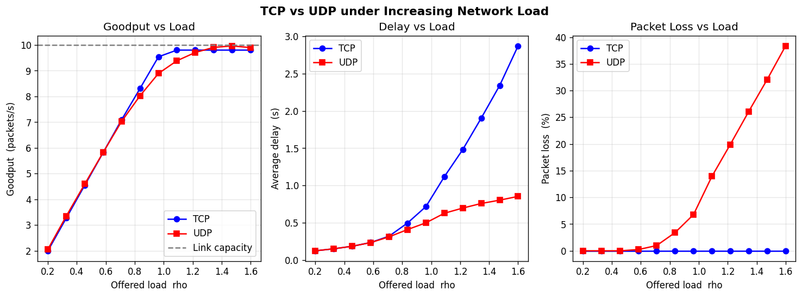
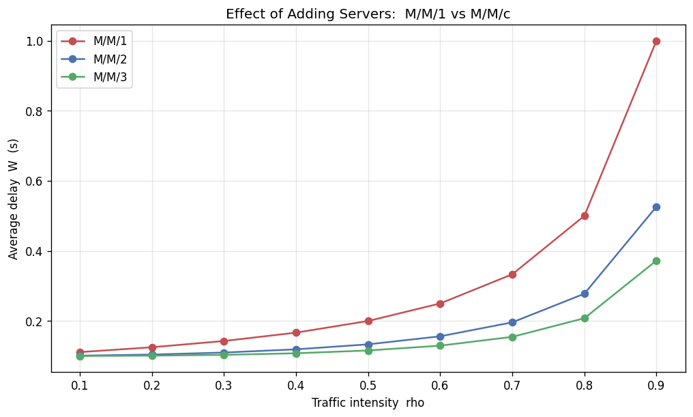

# 📡 Network Protocol Performance Analyzer

**Performance Engineering Lab [17M15CS122] — JIIT Sector 62, Noida**


[](https://network-performance-analyzer.streamlit.app)
[](https://colab.research.google.com/github/DEVANGDIXIT04/network-performance-analyzer/blob/main/Network_Performance_Analyzer_Colab.ipynb)


### 🌐 **Live app: https://network-performance-analyzer.streamlit.app**
### ☁️ **Run in Colab: https://colab.research.google.com/github/DEVANGDIXIT04/network-performance-analyzer/blob/main/Network_Performance_Analyzer_Colab.ipynb**

A queuing-theory based simulator that models network packet queues, measures
performance metrics, validates them against closed-form theory, and compares
the behaviour of the **TCP** and **UDP** transport protocols under increasing load.

It ships in **three ways to run it**:
1. 🖥️ **Interactive web app** (Streamlit) — sliders + live graphs
2. ⌨️ **Menu-driven CLI** (`main.py`)
3. ☁️ **Google Colab notebook** — one-click, self-contained ([open it here](https://colab.research.google.com/github/DEVANGDIXIT04/network-performance-analyzer/blob/main/Network_Performance_Analyzer_Colab.ipynb))

**Team:** Abhijeet Kumar (22803029) · Viyom Shukla (22803030) · Devang Dixit (22803031)

---

## 1. What it does

Packets arrive as a **Poisson process** (rate λ), wait in a queue served by one
or more servers with **exponential** service times (rate μ), and are measured
using **discrete-event simulation (SimPy)**. The results are checked against the
exact formulas of queuing theory:

| Model      | Meaning                              | Validated with        |
|------------|--------------------------------------|-----------------------|
| **M/M/1**  | single server, infinite buffer       | Little's Law          |
| **M/M/c**  | c parallel servers, infinite buffer  | Erlang-C formula      |
| **M/M/c/K**| c servers, finite buffer (loss)      | Birth–death balance   |

It then models **TCP vs UDP** under overload and plots every result with Matplotlib.

---

## 2. Project structure

```
NetworkPerformanceAnalyzer/
├── app.py                      # 🖥️  Streamlit interactive web frontend
├── main.py                     # ⌨️  menu-driven CLI entry point
├── Network_Performance_Analyzer_Colab.ipynb   # ☁️  self-contained Colab notebook
├── Network_Performance_Analyzer_Report.docx   # 📄  full 9-chapter project report
├── Network_Performance_Analyzer_Presentation.pptx  # 🎤  13-slide presentation deck
├── requirements.txt
├── README.md
├── PRESENTATION_GUIDE.md       # step-by-step demo + viva Q&A
├── DEPLOY.md                   # how the live app is hosted
├── results/                    # graphs are saved here automatically
└── src/
    ├── traffic_generator.py    # Step 1  Poisson arrivals / exp. service
    ├── queue_models.py         # Steps 2-4  SimPy M/M/1, M/M/c, M/M/c/K
    ├── theoretical.py          # closed-form formulas (Little's Law, Erlang-C)
    ├── metrics.py              # Step 5  throughput / delay / loss / utilisation
    ├── protocol_comparison.py  # Step 6  TCP vs UDP
    └── visualization.py        # Matplotlib graphs
```

The pipeline mirrors the six steps in the synopsis:
*Traffic Generation → Queue Modelling → Packet Processing → Data Collection →
Performance Evaluation → Protocol Comparison & Visualisation.*

---

## 3. Setup

```bash
# from the NetworkPerformanceAnalyzer folder
pip install -r requirements.txt
```

Requires Python 3.x with **SimPy, NumPy, SciPy, Matplotlib, Pandas**.

---

## 4. How to run

### 🖥️ A) Interactive web app (recommended for the demo)
A dynamic dashboard — move the sliders and every metric, table and graph
recomputes live.
```bash
streamlit run app.py
```
Then open the URL it prints (usually http://localhost:8501). Tabs:
*Single Simulation · Load Sweep · Server Comparison · TCP vs UDP.*

> **🌐 Live demo:** the app is hosted publicly at
> **https://network-performance-analyzer.streamlit.app** — no install needed.
> _(Free tier sleeps after inactivity; click "wake" and it returns in ~30 s.)_

### ⌨️ B) Menu-driven CLI
```bash
python main.py            # interactive menu
python main.py --demo     # runs everything, saves all graphs to results/
```

### ☁️ C) Google Colab (nothing to install)
Open **`Network_Performance_Analyzer_Colab.ipynb`** in Colab and click
*Runtime ▸ Run all*. It is self-contained and ends with **interactive sliders**.
[](https://colab.research.google.com/github/DEVANGDIXIT04/network-performance-analyzer/blob/main/Network_Performance_Analyzer_Colab.ipynb)

Individual modules can also be run directly for a quick self-test, e.g.:
```bash
python -m src.theoretical
python -m src.queue_models
python -m src.metrics
```

---

## 5. Performance metrics computed

| Metric            | Definition                                                        |
|-------------------|-------------------------------------------------------------------|
| **Throughput**    | packets successfully served per second                            |
| **Average delay** | mean time in system W = waiting + service time                    |
| **Packet loss**   | fraction of arrivals dropped because the buffer was full          |
| **Utilisation**   | fraction of time servers are busy, ρ = λ / (c·μ)                  |

Every scenario prints a **Simulation vs Theory** table with the absolute error,
so you can see the simulation reproduces the analytical results (errors are
typically < 1–2%).

---

## 6. Key results (from `--demo`)

* **M/M/1, M/M/c, M/M/c/K** simulations all match theory within a few percent.
* **Load sweep:** average delay stays flat then explodes as ρ → 1 (the classic
  queuing "knee"); throughput tracks the offered load until saturation.
* **Adding servers:** M/M/2 and M/M/3 keep delay far lower than M/M/1 at the
  same per-server load.
* **TCP vs UDP:** under overload, UDP loses a large fraction of packets while
  keeping low delay; TCP recovers all data (≈0 loss) and caps goodput at the
  link capacity, but its delay grows sharply — the reliability-vs-latency
  trade-off.

Generated graphs (in `results/`):

**Simulation validated against queuing theory (M/M/1):**


**TCP vs UDP under increasing load:**


**Adding servers lowers delay (M/M/1 vs M/M/c):**


---

## 7. References

1. Raj Jain, *The Art of Computer Systems Performance Analysis*, Wiley.
2. L. Kleinrock, *Queueing Systems, Vol. 1: Theory*, Wiley-Interscience.
3. A. S. Tanenbaum, *Computer Networks*, Pearson.
4. SimPy Documentation — https://simpy.readthedocs.io
5. Kurose & Ross, *Computer Networking: A Top-Down Approach*, Pearson.
